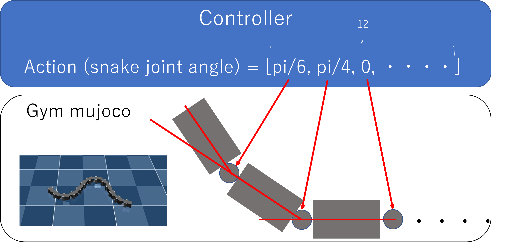
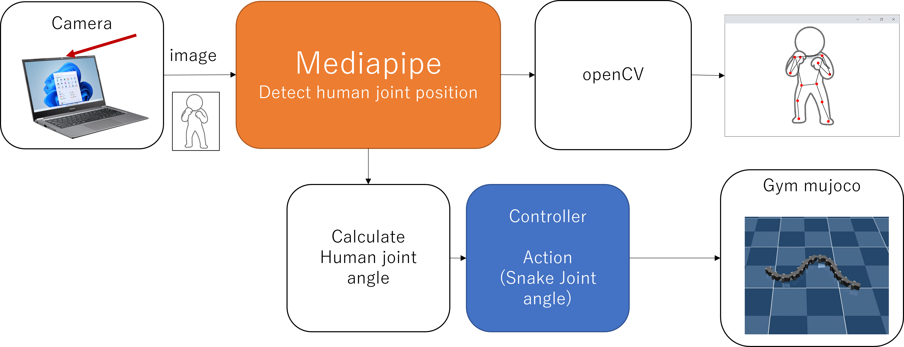

# Control snake robot by human pose detection

## Human pose detection
Pose detectin by mediapipe

mediapipe_test.py


```
python mediapipe_test.py
```

## Control snake in simulator
Control snake robot in simulator(gym,mujoco).

snake_sim_test.py



```
python snake_sim_test.py
```

## Control snake robot by human pose detection (simulation)

pose_snake_sim.py


```
python pose_snake_sim.py
```


## Control snake robot by human pose detection (real robot)

pose_snake_real.py


```
python pose_snake_real.py
```
